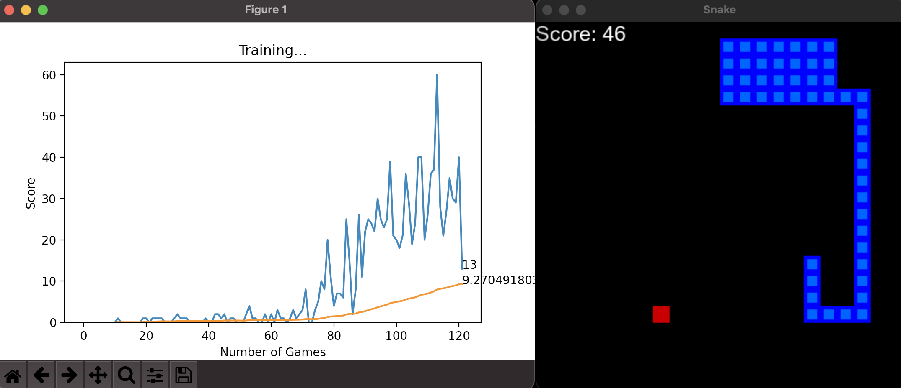

# snake-game-ai
An ML model that uses Q-net reinforcement learning to play snake.

Current direction, direction to food, direction to danger, and Manhattan distance from food are used as inputs. 

Positive rewards are given for collisions with fruit, negative rewards for collisions, and neutral rewards for "boring" states.

Averages a score of 50 after ~150 generations of training.
